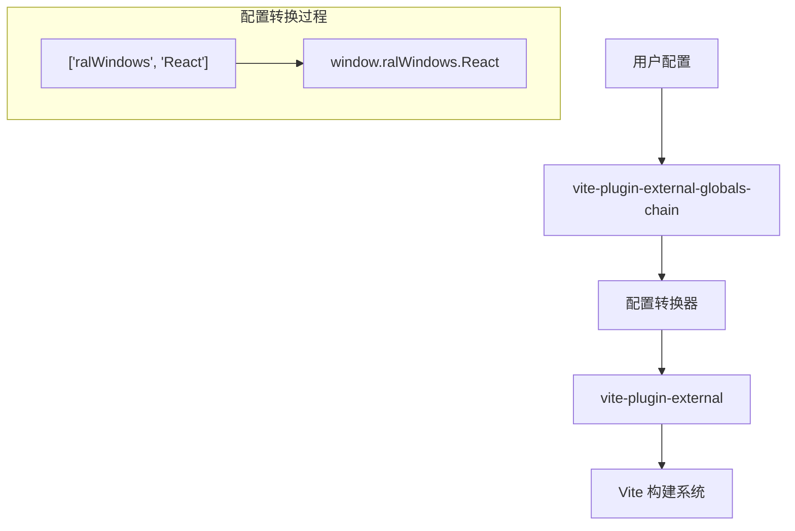

# Design Document

## Overview

vite-plugin-external-globals-chain 是一个轻量级的 wrapper 插件，它扩展了 vite-plugin-external 的功能，允许开发者使用数组形式配置外部依赖的全局变量路径。插件的核心职责是将数组配置转换为字符串形式，然后委托给 vite-plugin-external 处理实际的外部化逻辑。

## Architecture



插件采用简单的装饰器模式，在原有 vite-plugin-external 功能基础上添加配置预处理层。

## Components and Interfaces

### 1. 主插件函数

```typescript
interface WindowExternalConfig {
  [key: string]: string[] | string;
}

function windowExternal(config: WindowExternalConfig): Plugin
```

### 2. 配置转换器

```typescript
interface ConfigTransformer {
  transform(config: WindowExternalConfig): Record<string, string>;
}
```

转换逻辑：
- 输入：`{ react: ['ralWindows', 'React'] }`
- 输出：`{ react: 'window.ralWindows.React' }`

### 3. 类型定义

```typescript
type ExternalValue = string[] | string;

interface TransformedConfig {
  [packageName: string]: string;
}
```

## Data Models

### 输入配置模型
```typescript
interface WindowExternalConfig {
  [packageName: string]: ExternalValue;
}
```

### 转换后配置模型
```typescript
interface ExternalConfig {
  [packageName: string]: string;
}
```

### 转换规则
1. **数组转换**：`['a', 'b', 'c']` → `'window.a.b.c'`
2. **字符串保持**：`'window.someGlobal'` → `'window.someGlobal'`
3. **空数组处理**：抛出错误
4. **非字符串元素**：抛出类型错误

## Error Handling

### 1. 输入验证错误
- **空数组**：抛出 `Error('External value array cannot be empty')`
- **非字符串元素**：抛出 `TypeError('All array elements must be strings')`
- **无效配置**：抛出 `Error('Invalid configuration format')`

### 2. 委托错误处理
- 将 vite-plugin-external 的所有错误直接向上传播
- 不对底层插件的错误进行包装或修改

### 3. 错误恢复策略
- 配置转换失败时立即终止，不尝试部分转换
- 提供清晰的错误消息指明具体的配置问题

## Testing Strategy

### 1. 单元测试
- **配置转换测试**
  - 测试数组到字符串的正确转换
  - 测试字符串值的直接传递
  - 测试错误输入的异常处理

- **边界条件测试**
  - 空配置对象
  - 单元素数组
  - 多层嵌套数组
  - 混合配置（数组和字符串）

### 2. 集成测试
- **与 vite-plugin-external 集成**
  - 验证转换后的配置能被正确处理
  - 验证最终的外部化行为符合预期

- **Vite 构建测试**
  - 在实际 Vite 项目中测试插件功能
  - 验证运行时的全局变量访问

### 3. 类型测试
- TypeScript 类型定义的正确性
- 配置对象的类型安全
- 插件返回值的类型兼容性

## Implementation Details

### 核心转换算法
```typescript
function transformConfig(config: WindowExternalConfig): Record<string, string> {
  const result: Record<string, string> = {};
  
  for (const [key, value] of Object.entries(config)) {
    if (Array.isArray(value)) {
      if (value.length === 0) {
        throw new Error(`External value array for "${key}" cannot be empty`);
      }
      
      if (!value.every(item => typeof item === 'string')) {
        throw new TypeError(`All array elements for "${key}" must be strings`);
      }
      
      result[key] = `window.${value.join('.')}`;
    } else {
      result[key] = value;
    }
  }
  
  return result;
}
```

### 插件结构
```typescript
import pluginExternal from 'vite-plugin-external';

export default function windowExternal(config: WindowExternalConfig) {
  const transformedConfig = transformConfig(config);
  return pluginExternal(transformedConfig);
}
```

### 文件结构
```
src/
├── index.ts          # 主插件导出
├── transform.ts      # 配置转换逻辑
└── types.ts          # TypeScript 类型定义

tests/
├── transform.test.ts # 转换逻辑测试
├── plugin.test.ts    # 插件集成测试
└── fixtures/         # 测试用例数据
```